# 🚚 Sistema de Gerenciamento de Frotas (SGF) – LogiMax Transportes

## Briefing
O SGF é uma aplicação web para centralizar e otimizar o controle de veículos, motoristas e viagens da LogiMax Transportes. O sistema digitaliza o processo antes feito em quadro branco, permitindo cadastro de veículos e motoristas, criação de viagens e acompanhamento de rotas e quilometragem.

## Objetivo do Projeto
- Gerenciar informações sobre veículos, motoristas e viagens.
- Controlar quais motoristas estão com quais veículos e para onde estão indo.
- Permitir atualização da quilometragem ao final de cada viagem.
- Emitir alertas de manutenção preventiva a cada 10.000 km rodados.
- Proteger o acesso ao sistema com autenticação e papéis de usuário (Gestor / Motorista).

## Público-Alvo
- Gestor de Frota: cadastra veículos e motoristas, cria viagens e monitora o uso da frota.
- Motorista: visualiza apenas as viagens atribuídas a ele e atualiza a quilometragem ao final.

## Levantamento de Requisitos do Projeto

### Requisitos Funcionais
- Cadastro e autenticação de usuários (Gestor/Motorista) com diferentes níveis de acesso.
- CRUD de veículos (placa, modelo, ano, kmAtual).
- CRUD de motoristas (nome, CNH, telefone).
- Controle de viagens (origem, destino, status, associação de motorista e veículo).
- Atualização de quilometragem ao finalizar viagem.
- Alertas de manutenção preventiva a cada 10.000 km.
- Dashboard de monitoramento.

### Requisitos Não Funcionais
- Segurança com JWT e bcrypt.
- Interface simples e responsiva.
- Desempenho otimizado.
- Escalabilidade para futuras funcionalidades.

## Recursos do Projeto

### Tecnológicos
- Framework de Desenvolvimento: Next.js/React
- Linguagem de Programação: TypeScript
- Banco de Dados: MongoDB (Mongoose)
- Autenticação: JWT + bcrypt
- Estilos: SCSS
- GitHub, VsCode, Figma

### Pessoal
- Desenvolvedor Full Stack

## Análise de Risco

| Risco                           | Probabilidade | Impacto | Ação Preventiva                                  |
|----------------------------------|--------------|---------|--------------------------------------------------|
| Erros no cálculo de quilometragem| Média        | Alta    | Validar atualização de km no encerramento da viagem|
| Atrasos em alertas de manutenção | Baixa        | Média   | Implementar verificação automática no backend     |
| Falhas de login ou autenticação  | Média        | Alta    | Utilizar JWT com expiração e bcrypt seguro        |
| Dados inconsistentes de viagens  | Baixa        | Alta    | Regras de integridade entre motorista e veículo   |

## Diagramas

### 1. Classe

### 2. Caso de Uso

```mermaid
graph TD

    subgraph "SGF"
        caso1([Fazer Login])
        caso2([Gerenciar Veículos - CRUD])
        caso3([Gerenciar Motoristas - CRUD])
        caso4([Gerenciar Viagens - CRUD])
        caso5([Atualizar Quilometragem])
        caso6([Emitir Alerta de Manutenção])
        caso7([Acessar Dashboard])
    end

    Gestor([👨‍💼 Gestor de Frota])
    Motorista([🚚 Motorista])

    Gestor --> caso1
    Gestor --> caso2
    Gestor --> caso3
    Gestor --> caso4
    Gestor --> caso7

    Motorista --> caso1
    Motorista --> caso4
    Motorista --> caso5
    Motorista --> caso7

    caso4 --> caso6
```

### 3. Fluxo

```mermaid
graph TD
    A[Início] --> B{Acessa a Tela de Login}
    B --> C[Preencher Email e Senha]
    C --> D{Validar as Credenciais}
    D -->|Sim| E[Gerar um Token JWT]
    E --> F[Dashboard]
    D -->|Não| G[Mensagem de Erro]
    G --> B
```

---
